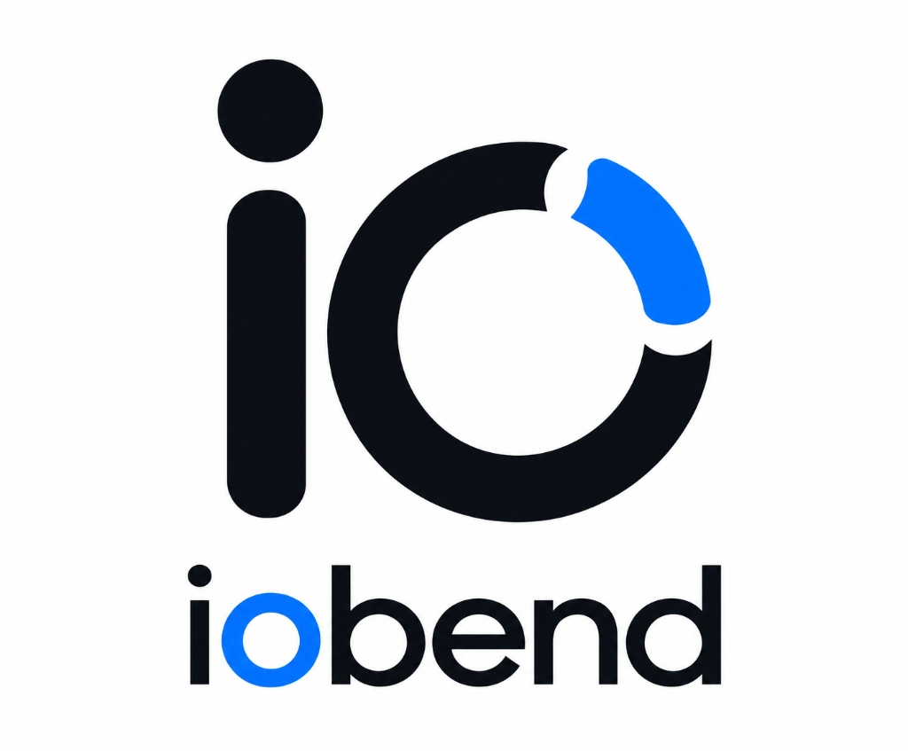

<div align="center">
  

# IOBend — The Developer Control Plane

**IOBend connects your development environment, tools, workflows, and AI in one platform.**

[](https://www.npmjs.com/package/iobend)
[](https://www.npmjs.com/package/iobend)
[](https://github.com/iobend/iobend/blob/main/LICENSE)

[Documentation](https://iobend.com/docs) • [Installation](https://iobend.com/docs#installation) • [Getting Started](https://iobend.com/docs#introduction) • [Cheat Sheet (PDF)](docs/cheetsheet/IOBend_CLI_v2.5.0_Developer_Cheat_Sheet_FINAL.pdf)
</div>

---

## What is IOBend?

IOBend is a unified platform connecting your development environment, tools, workflows, and AI. It provides a standardized control plane to diagnose local setup issues, scaffold projects, orchestrate container workflows, and manage environment configurations.

IOBend is one platform with multiple interfaces, rather than a collection of unrelated tools. It brings the robust design principles of modern infrastructure tooling directly into your local development workflow.

---

## One Platform. Multiple Ways to Work.

Interact with IOBend through the interface that best suits your workflow. Whether you prefer the speed of the terminal, the context of your IDE, or the visibility of a web dashboard, IOBend integrates seamlessly into your daily operations.

---

## Why IOBend?

Modern development requires juggling multiple discrete tools, scripts, and environments. IOBend centralizes these operations into a cohesive system that standardizes environments across teams, reduces context switching, and leverages AI to provide actionable developer intelligence.

---

## Detect → Understand → Act → Automate

IOBend follows a systematic workflow to streamline development:

- **Detect** — Identify environment, configuration, dependency, and workflow problems before they block your progress.
- **Understand** — Use context and AI-powered intelligence to diagnose what is happening and explain why.
- **Act** — Execute targeted recommendations and tasks through the CLI, IDE, or integrations.
- **Automate** — Turn repetitive workflows, configurations, and fixes into repeatable automation for your team.

---

## 📖 Developer Cheat Sheet

Quickly master all commands, aliases, container recipes, and MCP servers with our official printable guide:

- 📄 **[Download IOBend CLI v2.5.0 Developer Cheat Sheet (PDF)](docs/cheetsheet/IOBend_CLI_v2.5.0_Developer_Cheat_Sheet_FINAL.pdf)**

---

## Core Capabilities

IOBend provides a robust set of capabilities to manage your development lifecycle:

- 🚀 **Environment Diagnostics:** Detect and diagnose misconfigurations and missing dependencies across your system.
  ```bash
  iobend doctor
  ```
- 🛠 **Project Scaffolding:** Generate standardized boilerplates, configurations, and CI pipelines instantly.
  ```bash
  iobend generate --template nodejs-docker
  ```
- 🐳 **Container Workflows:** Effortlessly orchestrate local containers and containerized development environments.
  ```bash
  iobend container
  ```
- 🔐 **Authentication & Environment:** Manage your CLI session, identity, and secure secrets.
  - `iobend login` — Authenticates your local CLI with your IOBend account. Opens a browser-based OAuth flow.
  - `iobend logout` — Logs out the currently authenticated CLI session. Removes the locally stored API keys.
  - `iobend whoami` — Displays the currently authenticated user profile, email, plan, workspace, and context.
- 🧠 **AI-Powered Developer Intelligence:** Receive contextual diagnostic assistance, explanations, and actionable recommendations.
- 🧩 **MCP / Extensibility:** Leverage the Model Context Protocol (MCP) to plug in custom tools and connect with LLMs.
  ```bash
  iobend mcp
  ```

---

## IOBend Interfaces

### 1. CLI (Available)

Execute developer workflows, diagnostic commands, and automation scripts directly from the terminal.

### 2. VS Code Extension (Available)

Use IOBend directly inside your IDE for seamless, in-context intelligence and environment management.

### 3. Cloud (Live)

Manage projects, environments, configurations, cloud integrations, and team collaboration workflows from a centralized web dashboard.

### 4. AI (Live)

Provide contextual developer intelligence, diagnostics, recommendations, and workflow assistance across all IOBend surfaces.

### 5. SDK (Live)

An enterprise TypeScript/JavaScript extensibility layer for building custom integrations, zero-trust secret injection, and custom tooling on top of the IOBend platform.

---

## Installation

### macOS & Linux (Homebrew)

```bash
brew tap Iobend/tap
brew install iobend
```

### Windows (WinGet)

```powershell
winget install iobend
```

### Linux, macOS & Windows (npm)

```bash
npm install -g iobend
```

### Verify Installation

```bash
iobend --version
```

---

## Getting Started

### 1. Diagnose Your Environment

Ensure your machine is ready for development by running the built-in diagnostic tool.

```bash
iobend doctor
```

### 2. Scaffold a New Project

Create a complete Node.js project with Docker configurations.

```bash
iobend generate --template nodejs-docker
```

### 3. Connect Integrations

Authenticate with your cloud provider or CI/CD platform.

```bash
iobend auth login --provider aws
```

---

## Roadmap

- [x] Initial CLI release (v1.0.0)
- [x] macOS and Linux support
- [x] Windows native installer
- [x] Initial CLI release (v2.0.0)
- [x] VS Code Extension integration
- [x] Official Homebrew Tap (macOS & Linux)
- [x] Extensibility SDK (@iobend/sdk)
- [x] Cloud Platform and Web Management Console
- [ ] Advanced GitOps integration (In Progress)
- [ ] Kubernetes cluster auto-provisioning (In Progress)

_See the [full roadmap](docs/roadmap.md) for more details._

---

## Who Is IOBend For?

IOBend is built for **Developers**, **Platform Engineers**, and **Enterprise Teams** who need a structured, reliable, and intelligent control plane to manage the increasingly complex landscape of modern software development.

---

## Contributing

We welcome contributions from the community! If you're interested in improving IOBend, please check out our [Contributing Guide](docs/contributing.md) and [Development Setup](docs/contributing.md#development-setup).

---

## Community & Support

- **Documentation:** [Read the full docs](https://iobend.com/docs)
- **Issues:** [Report bugs or request features](https://github.com/iobend/iobend/issues)
- **X / Twitter:** [@IOBendDev](https://twitter.com/IOBendDev)

---

## License

IOBend is licensed under the [MIT License](LICENSE).
